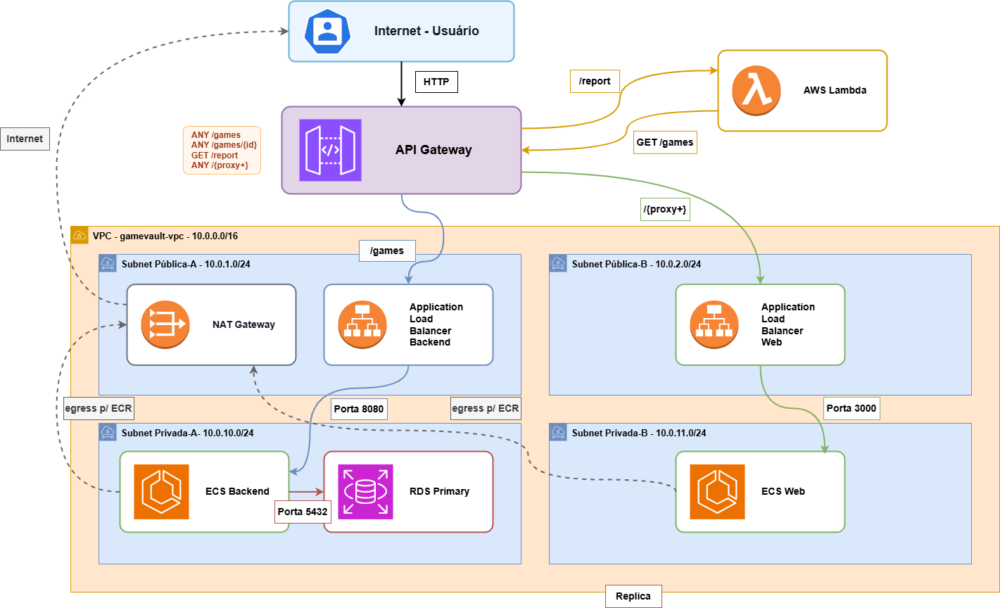

# 🎮 GameVault

    Projeto Integrador — Cloud Developing 2026/1

    Catálogo de jogos cloud-native deployado na AWS, com CRUD completo
    sobre a entidade Game e função Lambda dedicada para geração de
    relatório estatístico do catálogo.

    O objetivo do projeto é demonstrar na prática conceitos de:
    - Arquitetura serverless + containers gerenciados
    - Comunicação entre serviços via API Gateway
    - Banco de dados gerenciado em subnet privada (RDS)
    - Containerização com Docker e deploy em ECS Fargate
    - Função Lambda em Python consumindo API HTTP
    - Organização modular de projetos em Go

    Projeto desenvolvido para a disciplina de Serviços em Nuvem.

## 👥 Grupo

    1. 10418014 - Pedro Henrique Leite - Projeto completo
       (back-end, front-end, Lambda, infraestrutura AWS, documentação)

## 🎯 Visão Geral

    O GameVault é um catálogo de jogos cloud-native que demonstra os
    principais serviços da AWS exigidos pela disciplina: containers
    gerenciados (ECS Fargate), banco gerenciado em subnet privada (RDS),
    gateway de API único como ponto de entrada (API Gateway) e função
    serverless (Lambda).

    O domínio "catálogo de jogos" foi escolhido por permitir uma
    entidade rica o suficiente para gerar estatísticas interessantes
    (rating médio, distribuição por gênero e plataforma, jogos com
    maior e menor nota) — o que dá propósito real à rota /report
    da Lambda.

    O CRUD permite ao usuário criar, listar, editar e excluir jogos
    através de uma interface web com tema visual customizado. Cada
    operação é feita via JavaScript no navegador, chamando
    exclusivamente o API Gateway. A rota /report consome a própria
    API (sem acessar o RDS) e devolve estatísticas calculadas em
    tempo real.

## 🧠 Arquitetura da Aplicação

    A aplicação é composta por três serviços independentes orquestrados
    por um único API Gateway, que atua como ponto de entrada.

    Usuário
    ↓
    Amazon API Gateway
    ↓
    ├── /games, /games/:id  →  Backend Go (ECS Fargate)
    │                          ↓
    │                          Amazon RDS PostgreSQL (subnet privada)
    │
    ├── /report             →  Lambda Python
    │                          ↓
    │                          GET /games (via API Gateway)
    │                          ↓
    │                          Calcula estatísticas e retorna JSON
    │
    └── /*                  →  Frontend Go (ECS Fargate)
                               ↓
                               Serve HTML, CSS e JavaScript

    Regras críticas da arquitetura:
    - O frontend não fala diretamente com o backend, tudo passa pelo API Gateway
    - A Lambda não acessa o RDS, apenas consome a API HTTP
    - O RDS fica em subnet privada, sem porta exposta à Internet
    - O JS no browser chama o API Gateway (CORS habilitado)

## ⚙️ Tecnologias Utilizadas

    - Go 1.25 (backend)
    - Go 1.24 (frontend)
    - Gin Framework
    - GORM (ORM com auto-migration)
    - Python 3.12 (Lambda)
    - PostgreSQL 17
    - Docker (multi-stage build)
    - Docker Compose
    - AWS API Gateway (HTTP API)
    - AWS ECS Fargate
    - AWS RDS
    - AWS Lambda
    - AWS ECR
    - AWS VPC
    - AWS NAT Gateway
    - AWS Application Load Balancer

## 📂 Estrutura do Projeto

    aws-gamevault/                            # Raiz do projeto
    │
    ├── backend/                              # API REST do CRUD (Go + Gin + GORM)
    │   │
    │   ├── controllers/                      # Camada HTTP da aplicação
    │   │   ├── game_controller.go            # Endpoints CRUD de /games
    │   │   └── report_controller.go          # Versão dev local da Lambda
    │   │
    │   ├── database/                         # Conexão com PostgreSQL
    │   │   └── connection.go                 # GORM + AutoMigrate
    │   │
    │   ├── models/                           # Entidades de domínio
    │   │   └── game.go                       # Struct Game e validações
    │   │
    │   ├── Dockerfile                        # Container Docker da API
    │   ├── main.go                           # Inicialização do Gin (porta 8080)
    │   ├── go.mod                            # Dependências do módulo Go
    │   └── go.sum
    │
    ├── web/                                  # Aplicação Web
    │   │
    │   ├── controllers/                      # Controladores da aplicação web
    │   │   └── page_controller.go            # Renderização da página HTML
    │   │
    │   ├── static/                           # Arquivos estáticos
    │   │   ├── css/style.css                 # Tema Dark Vault
    │   │   └── js/app.js                     # Lógica do frontend (Fetch API)
    │   │
    │   ├── templates/index.html              # Interface do catálogo
    │   ├── Dockerfile                        # Container Docker da aplicação web
    │   ├── main.go                           # Inicialização do servidor (porta 3000)
    │   ├── go.mod
    │   └── go.sum
    │
    ├── lambda/                               # Função AWS Lambda
    │   └── report.py                         # Cálculo de estatísticas
    │
    ├── sql/                                  # Scripts de banco
    │   └── init.sql                          # CREATE TABLE + 10 jogos seed
    │
    ├── docs/                                 # Documentação adicional
    │   ├── arquitetura.png                   # Diagrama da arquitetura
    │   ├── DEPLOY.md                         # Guia de deploy na AWS
    │   ├── VIDEO.md                          # Roteiro do vídeo de apresentação
    │   └── PDF.md                            # Estrutura do PDF técnico
    │
    ├── docker-compose.yml                    # Orquestração para dev local
    ├── .gitignore
    ├── LICENSE
    └── README.md

## 🐳 Como Rodar Localmente

    Pré-requisito: Docker Desktop instalado e em execução.

    Na raiz do projeto:
    docker compose up --build

    Aguarde as três mensagens de boot:
    - gamevault-db        ... healthy
    - gamevault-backend   ... conexão com PostgreSQL estabelecida
    - gamevault-web       ... Listening and serving HTTP on :3000

    Acesse:
    - Frontend     → http://localhost:3000
    - API direta   → http://localhost:8080/games

    Para parar tudo e limpar volumes (recomeçar com seed):
    docker compose down -v

    Variáveis de ambiente do backend:
    - DB_HOST       host do PostgreSQL
    - DB_PORT       porta do PostgreSQL
    - DB_USER       usuário
    - DB_PASSWORD   senha
    - DB_NAME       nome do banco
    - GIN_MODE      release em produção, debug por padrão

    Variáveis de ambiente do frontend:
    - WEB_PORT          porta de escuta (padrão 3000)
    - API_GATEWAY_URL   URL base do API Gateway

## 🧪 Endpoints da API

    GET    /games          → Lista todos os jogos
    GET    /games/:id      → Busca jogo por ID
    POST   /games          → Cria um novo jogo
    PUT    /games/:id      → Atualiza jogo existente
    DELETE /games/:id      → Remove jogo
    GET    /report         → Estatísticas do catálogo (Lambda)

    Códigos de status:
    - 200 OK
    - 201 Created
    - 400 Bad Request (validação)
    - 404 Not Found
    - 500 Internal Server Error
    - 502 Bad Gateway (Lambda não conseguiu consumir API)

## 🗃️ Modelo da Entidade Game

    A aplicação gira em torno de uma única entidade principal.

    Atributos:
    - id           identificador único (auto-incremento)
    - name         nome do jogo (obrigatório)
    - genre        gênero (obrigatório)
    - platform     plataforma (obrigatório)
    - rating       nota de 0 a 10 (obrigatório)
    - release_year ano de lançamento (obrigatório)
    - created_at   timestamp de criação
    - updated_at   timestamp da última atualização

    Exemplo de resposta da API:
    {
        "id": 1,
        "name": "The Witcher 3: Wild Hunt",
        "genre": "RPG",
        "platform": "PC",
        "rating": 9.8,
        "release_year": 2015,
        "created_at": "2026-05-07T12:17:02.781694Z",
        "updated_at": "2026-05-07T12:17:02.781694Z"
    }

## ⚡ Função Lambda /report

    Função Python que recebe um evento do API Gateway, consome a rota
    GET /games via HTTP (sem acessar o RDS) e calcula estatísticas
    em memória.

    Estatísticas calculadas:
    - total de jogos no catálogo
    - rating médio
    - distribuição por gênero
    - distribuição por plataforma
    - jogo com maior rating
    - jogo com menor rating

    Variável de ambiente da Lambda:
    - API_URL    URL base do API Gateway

    Exemplo de resposta:
    {
        "total_games": 10,
        "average_rating": 9.06,
        "games_by_genre": { "RPG": 4, "FPS": 2, "Action": 1, ... },
        "games_by_platform": { "PC": 7, "PlayStation": 2, "Xbox": 1 },
        "highest_rated": { "name": "The Witcher 3", "rating": 9.8 },
        "lowest_rated": { "name": "Cyberpunk 2077", "rating": 7.5 }
    }

## ☁️ Arquitetura Planejada na AWS

    Internet
    ↓
    Amazon API Gateway (HTTP API)
    ↓
    ├── ECS Fargate Web Service     → Frontend (porta 3000)
    ├── ECS Fargate Backend Service → API REST (porta 8080)
    │                                   ↓
    │                                   Amazon RDS PostgreSQL
    │                                   (subnet privada)
    └── AWS Lambda                  → /report

    Regras de segurança:
    - RDS aceita conexão apenas do Security Group do ECS backend
    - Backend não tem porta pública, fica atrás do API Gateway
    - Lambda não tem acesso ao RDS, apenas à API via HTTP
    - CORS configurado no API Gateway para o domínio do frontend

    Ordem de provisionamento no Console AWS:
    1. VPC 10.0.0.0/16 com 2 subnets públicas e 2 privadas em AZs diferentes
    2. Internet Gateway anexado à VPC + NAT Gateway em subnet pública
    3. Route Tables: pública (rota para IGW) e privada (rota para NAT)
    4. Security Groups em camadas (alb-backend, alb-web, ecs, rds)
    5. RDS PostgreSQL 17 em subnet privada, Public access No
    6. ECR com repositórios para as imagens do backend e do web
    7. ECS Fargate Cluster com 2 services (tasks em subnet privada)
    8. 2 ALBs internet-facing apontando para os services
    9. Lambda Python 3.12 com report.py
    10. API Gateway HTTP API com 4 rotas e 3 integrações
    11. CORS configurado no API Gateway

    A tabela games é criada automaticamente pelo AutoMigrate do GORM
    no primeiro boot do backend. Documentação completa do deploy
    está em docs/DEPLOY.md.

## 📎 Autor

    Este projeto foi desenvolvido por Pedro Henrique Leite

## 📄 Licença

    Este projeto é de uso educacional, sem fins comerciais.
    Sinta-se à vontade para utilizar como referência em seus estudos!
